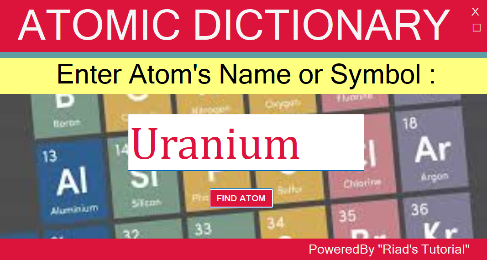
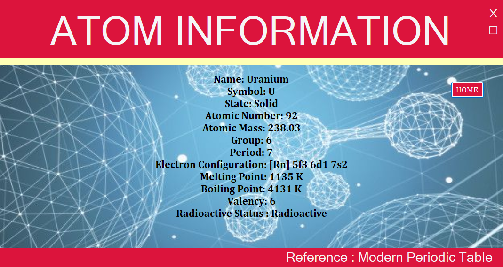
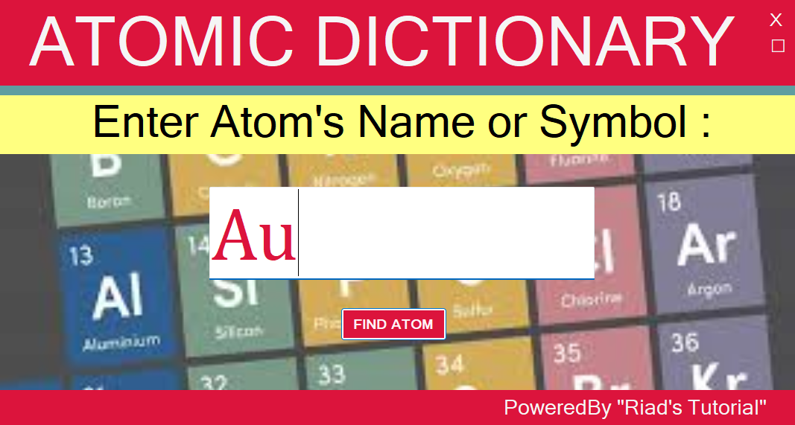
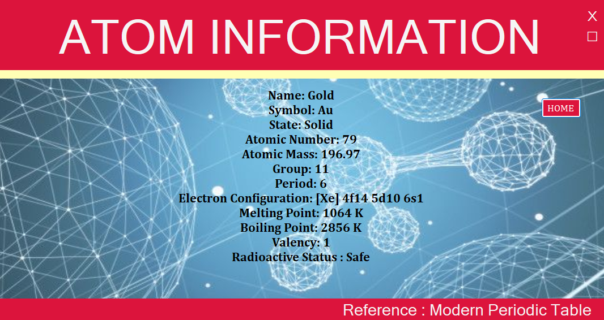

# Atomic Dictionary

## 📝 Summary
**Atomic Dictionary** is a Windows Forms Application made in C#.  
It helps users find basic information about chemical elements (atoms) using their **name** or **symbol**.

---

## ⭐ Features

- Search by atom **name** or **symbol**  
- See useful information about the element  
- Clean and simple user interface  
- Easy to use for students and beginners

---

## 🛠️ Technologies Used

- C# (C Sharp)
- Windows Forms (WinForms)
- .NET 8.0
- Visual Studio

---

## 🔰 How It Works

1. Open the application.
2. Enter an atom's **name** or **symbol** in the input box.
3. Click **Find Atom**.
4. A new window will show details about the atom.

---

## ▶️ How to Run

1. Open the project in **Visual Studio** (2022 or later).
2. Make sure `.NET 8.0` is installed.
3. Build the project.
4. Run the application (Press `F5`).

---

## ✅ Requirements

- Windows OS
- .NET 8.0 SDK
- Visual Studio (with Windows Forms support)

---

## 🖼️ Interfaces

<table>
  <tr>
    <td></td>
    <td></td>
  </tr>
  <tr>
    <td></td>
    <td></td>
  </tr>
</table>

---

## 👤 Author

Md. Riad Hasan  
BSCSE    
Uttara University
